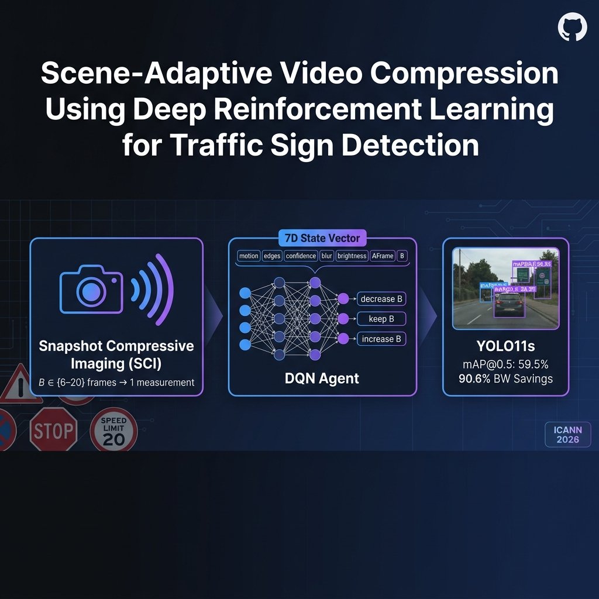

<div align="center">
  
</div>

# Reinforcement Learning-Based Adaptive Video Compression for Traffic Sign Detection

[](https://www.python.org/)
[](https://pytorch.org/)
[](https://docs.ultralytics.com/)
[](LICENSE)

**Scene-Adaptive Video Compression Using Deep Reinforcement Learning for Safety-Critical Traffic Sign Detection**

> 📄 **Paper:** *Scene-Adaptive Video Compression Using Deep Reinforcement Learning for Safety-Critical Traffic Sign Detection* — submitted to **ICANN 2026** (Springer LNCS format).

---

## Abstract

This repository implements an end-to-end adaptive video compression framework combining **Snapshot Compressive Imaging (SCI)**, a **YOLO11s** object detector operating directly on compressed measurements, and a **Deep Q-Network (DQN)** agent that dynamically selects the temporal compression ratio $B \in [6, 20]$ at the frame level.

The agent observes a lightweight **7-dimensional state vector** (motion intensity, edge density, detector confidence, blur score, brightness, frame difference, current B) and outputs incremental adjustments to the compression ratio. A **safety-aware reward function** imposes heavy penalties ($\lambda = 2.0$) for missing critical traffic signs (Stop, Yield, No Entry), ensuring the policy preserves detection in adverse conditions.

### Key Results

| Strategy | Avg Detections | Avg B | BW Savings |
|----------|:-:|:-:|:-:|
| Fixed B=6 | 141.2 | 6.0 | 83.3% |
| Fixed B=10 | 130.9 | 10.0 | 90.0% |
| Fixed B=14 | 122.0 | 14.0 | 92.9% |
| Fixed B=18 | 114.4 | 18.0 | 94.4% |
| **Adaptive (DQN)** | **128.6** | **10.78 ± 1.48** | **90.6%** |

The RL agent achieves **90.6% bandwidth savings** with **128.6 average detections**, matching Fixed B≈10 performance while **adapting per-scene**: B=9.0 under noise (preserving safety) → B=14.3 under rain (saving bandwidth) — a **59% variation** in compression ratio across challenge types.

---

## Table of Contents

- [Quick Start](#quick-start)
- [Installation](#installation)
- [Dataset Preparation](#dataset-preparation)
- [Training](#training)
- [Evaluation](#evaluation)
- [Results](#results)
- [Project Structure](#project-structure)
- [Citation](#citation)
- [License](#license)
- [Acknowledgments](#acknowledgments)

---

## Quick Start

### Using Pre-Trained Models

**Trained models available in the repository:**
- **DQN Agent:** `runs/rl_training_adaptive/best_model_adaptive.pth` (296 KB)
- **YOLO11s (640px):** `runs/train/yolo11s_cure_tsd_640/weights/best.pt` (19.2 MB)
- **YOLOv8n (legacy):** `runs/train/yolo_cure_tsd/weights/best.pt` (6.25 MB)

**Run evaluation:**
```bash
# Fixed-B baselines (B = 6, 10, 14, 18)
python scripts/evaluate_fixed_B.py --model runs/train/yolo11s_cure_tsd_640/weights/best.pt

# RL agent evaluation
python scripts/evaluate_rl_agent.py --model runs/train/yolo11s_cure_tsd_640/weights/best.pt
```

**Quick analysis:**
```bash
python generate_performance_tables.py
python quick_training_summary.py
```

---

## Installation

### System Requirements

| Requirement | Minimum |
|-------------|---------|
| **GPU** | NVIDIA with CUDA support (8GB+ VRAM) |
| **CUDA** | 12.1 or higher |
| **Python** | 3.12 (strictly required) |
| **Storage** | 50GB+ free space |
| **OS** | Linux, macOS, or Windows |

### Environment Setup

```bash
# 1. Clone
git clone https://github.com/ManveerAnand/Reinforcement-Learning-Based-Adaptive-Video-Compression-for-Traffic-Sign-Detection.git
cd Reinforcement-Learning-Based-Adaptive-Video-Compression-for-Traffic-Sign-Detection

# 2. Create environment
conda create -n rl_video_compression python=3.12
conda activate rl_video_compression

# 3. Install dependencies
pip install -r requirements.txt

# 4. Verify
python -c "import torch; print(f'PyTorch: {torch.__version__}, CUDA: {torch.cuda.is_available()}')"
```

---

## Dataset Preparation

### CURE-TSD Dataset

The framework uses the **CURE-TSD** (Challenging Unreal and Real Environments for Traffic Sign Detection) dataset:

| Property | Value |
|----------|-------|
| **Videos** | 1,805 sequences (1,525 train / 280 val) |
| **Resolution** | 1628 × 1236 pixels |
| **Frame Rate** | 10 FPS |
| **Classes** | 14 traffic sign types |
| **Challenges** | 12 types (Rain, Snow, Noise, Dark, etc.) |
| **Source** | [Georgia Tech OLIVES Lab](https://github.com/olivesgatech/CURE-TSD) |

### Generate SCI Measurements (V2 Dataset)

```bash
# Generate SCI compressed measurements for B ∈ {6, 8, 10, 12, 14, 16, 18, 20}
python scripts/generate_dataset_v2_fast.py
```

**Output structure:**
```
data/yolo_dataset_v2/
├── images/
│   ├── train/     # ~20,946 compressed measurements
│   └── val/       # ~5,574 compressed measurements
├── labels/
│   ├── train/
│   └── val/
└── data.yaml
```

---

## Training

> **Important:** Training scripts must be run from the `training/` directory. Evaluation scripts must be run from the project root.

### 1. Train YOLO11s Detector

Train the YOLO11s model on SCI-compressed measurements:

```bash
cd training
python train_yolo_v2.py
```

| Parameter | Value |
|-----------|-------|
| **Architecture** | YOLO11s (9.4M parameters, 21.3 GFLOPs) |
| **Image Size** | 640×640 |
| **Batch Size** | 16 |
| **Epochs** | 200 |
| **Optimizer** | AdamW (lr=0.002, cosine decay) |
| **Precision** | Mixed (AMP) |
| **B-values** | {6, 8, 10, 12, 14, 16, 18, 20} |
| **Training Time** | ~17 hours on RTX 4060 Laptop |

**Auto-resume:** Training automatically resumes from `runs/train/yolo11s_cure_tsd_640/weights/last.pt` if interrupted. Corrupted checkpoints are detected and purged automatically.

> **960px variant:** A higher-resolution training script is preserved at `training/train_yolo_v2_960px.py` (requires fp32, batch=4, ~65 hours). Use only if 8GB+ VRAM is available and fp32 stability is confirmed.

### 2. Train RL Agent (DQN)

Train the DQN agent for adaptive B-value selection:

```bash
cd training
python train_rl_agent_adaptive.py
```

| Parameter | Value |
|-----------|-------|
| **Algorithm** | Deep Q-Network (DQN) |
| **Network** | 7 → 128 → 128 → 3 (FC + ReLU) |
| **State Space** | 7D (motion, edges, confidence, blur, brightness, Δframe, B) |
| **Action Space** | {decrease_B, keep_B, increase_B} → {-2, 0, +2} |
| **B Range** | [6, 20], step 2 |
| **Replay Buffer** | 10,000 transitions |
| **Exploration** | ε-greedy (1.0 → 0.01, decay 0.995/ep) |
| **Episodes** | 500 (~4 hours) |

**Safety-Aware Reward Function:**

$$R_t = w_{det} \cdot S_{det} + w_{bw} \cdot \frac{B_t}{B_{max}} - \lambda \cdot M_t^{crit} - P_B$$

where:
- $w_{det}, w_{bw}$ are scene-adaptive weights driven by complexity $\kappa$
- $\lambda = 2.0$ per missed critical sign (Stop, Yield, No Entry)
- $P_B$ penalizes inappropriate B for scene complexity

---

## Evaluation

All evaluations use the **280 validation videos** (synthetic sequences `02_*`) from CURE-TSD.

### Fixed-B Baselines

```bash
python scripts/evaluate_fixed_B.py --model runs/train/yolo11s_cure_tsd_640/weights/best.pt --B 6 10 14 18
```

### RL Agent

```bash
python scripts/evaluate_rl_agent.py --model runs/train/yolo11s_cure_tsd_640/weights/best.pt
```

### Output Files

Results are saved to `outputs/benchmarks/`:
- `fixed_B_baselines.json` — Fixed B-value results
- `rl_agent_results.csv` — Per-video RL agent results
- `rl_agent_summary_v2.json` — Aggregate RL summary

---

## Results

### YOLO11s Detection Performance

Trained on 26,520 SCI measurements across B ∈ {6, 8, 10, 12, 14, 16, 18, 20}:

| Metric | Value |
|--------|-------|
| **mAP@0.5** | 59.5% |
| **mAP@0.5:0.95** | 35.7% |
| **Precision** | 62.0% |
| **Recall** | 52.6% |
| **Parameters** | 9.4M |
| **Inference** | 2.7ms/image |

> **Note:** The expanded B-range includes heavily compressed measurements (B=14–20) where signs are severely degraded, which lowers aggregate mAP compared to narrow-range training. This coverage is essential for the RL agent to evaluate detection across its full operating range.

### Compression Strategy Comparison

| Strategy | Avg Detections | Confidence | Avg B | BW Savings |
|----------|:-:|:-:|:-:|:-:|
| Fixed B=6 | 141.2 | 0.391 | 6.0 | 83.3% |
| Fixed B=10 | 130.9 | 0.392 | 10.0 | 90.0% |
| Fixed B=14 | 122.0 | 0.383 | 14.0 | 92.9% |
| Fixed B=18 | 114.4 | 0.376 | 18.0 | 94.4% |
| **Adaptive (DQN)** | **128.6** | **0.388** | **10.78 ± 1.48** | **90.6%** |

### Scene-Adaptive Behavior (Key Result)

The RL agent adapts compression per-challenge type:

| Challenge | Avg Det | Avg B | BW% | Strategy |
|-----------|:-:|:-:|:-:|----------|
| Codec | 156.1 | 10.39 | 90.4% | → Baseline |
| Clear | 147.8 | 10.28 | 90.3% | → Baseline |
| Decolor | 148.8 | 10.28 | 90.3% | → Baseline |
| LensBlur | 146.9 | 10.48 | 90.4% | → Baseline |
| Shadow | 146.0 | 10.57 | 90.5% | → Baseline |
| **Noise** | **139.0** | **9.02** | **88.9%** | ↓ **Reduces compression (safety)** |
| Dark | 139.6 | 10.77 | 90.7% | → Slight increase |
| GaussBlur | 134.9 | 10.73 | 90.6% | → Slight increase |
| Dirty | 133.2 | 10.53 | 90.5% | → Baseline |
| Snow | 120.3 | 10.13 | 90.1% | → Cautious |
| Expose | 84.6 | 11.51 | 91.3% | ↑ Saves BW (quality already poor) |
| **Rain** | **61.1** | **14.29** | **93.0%** | ↑↑ **Aggressive savings** |

**Key Insight:** The agent reduces B to **9.02** for noise (preserving safety-critical sign detection) and increases B to **14.29** for rain (where detection is already severely degraded) — a **59% variation** in compression ratio demonstrating genuine scene adaptation.

---

## Project Structure

```
RL_Video_Compression/
├── data/
│   ├── cure-tsd/              # Original CURE-TSD dataset
│   │   ├── data/              # Video files (01_*, 02_*)
│   │   └── labels/            # Ground-truth annotations
│   ├── masks/                 # Binary SCI masks
│   └── yolo_dataset_v2/       # Generated YOLO dataset (V2, 8 B-values)
│
├── src/
│   ├── phase1/                # Core compression & RL environment
│   │   ├── video_compression_env.py  # Gym-style RL environment
│   │   ├── sci_compressor.py         # SCI forward model
│   │   └── feature_extractor.py      # 7D state extraction
│   └── phase5/                # Dataset generation utilities
│       ├── dataset_builder.py
│       ├── label_converter.py
│       └── measurement_generator.py
│
├── training/                  # Training scripts (run from this directory)
│   ├── train_yolo_v2.py              # YOLO11s training (640px, current)
│   ├── train_yolo_v2_960px.py        # YOLO11s training (960px, future)
│   ├── train_yolo_local.py           # YOLOv8n training (legacy)
│   ├── train_rl_agent_adaptive.py    # DQN training
│   └── validate_yolo.py
│
├── scripts/                   # Evaluation & utilities (run from root)
│   ├── evaluate_fixed_B.py           # Fixed-B baseline evaluation
│   ├── evaluate_rl_agent.py          # RL agent evaluation
│   ├── generate_dataset_v2_fast.py   # V2 dataset generation
│   ├── generate_full_dataset.py      # V1 dataset generation (legacy)
│   └── generate_paper_figures.py     # Paper figure generation
│
├── paper/                     # ICANN 2026 submission
│   └── icann2026_submission/
│       ├── main.tex                  # Paper source
│       ├── paper_refs.bib            # Bibliography
│       └── figures/                  # Paper figures
│
├── outputs/                   # Experimental results
│   └── benchmarks/
│       ├── fixed_B_baselines.json
│       ├── rl_agent_results.csv
│       └── rl_agent_summary_v2.json
│
├── runs/                      # Model checkpoints
│   ├── rl_training_adaptive/         # DQN agent
│   └── train/
│       ├── yolo11s_cure_tsd_640/     # YOLO11s (current, 640px)
│       ├── yolo11s_cure_tsd/         # YOLO11s (960px, incomplete)
│       └── yolo_cure_tsd/            # YOLOv8n (legacy)
│
├── models/                    # Pre-trained base models
├── tests/                     # Unit tests
├── docs/                      # Additional documentation
├── requirements.txt
├── test_framework.py          # End-to-end reproducibility test
└── AGENTS.md                  # Agent instructions
```

---

## Citation

```bibtex
@inproceedings{anand2026sceneadaptive,
  title     = {Scene-Adaptive Video Compression Using Deep Reinforcement Learning for Safety-Critical Traffic Sign Detection},
  author    = {Anand, Manveer},
  booktitle = {Proceedings of the International Conference on Artificial Neural Networks (ICANN)},
  year      = {2026},
  publisher = {Springer},
  series    = {Lecture Notes in Computer Science}
}
```

---

## License

This project is licensed under the MIT License — see the [LICENSE](LICENSE) file for details.

---

## Acknowledgments

- **CURE-TSD Dataset**: Temel, D., et al. "CURE-TSD: Challenging unreal and real environments for traffic sign detection." arXiv preprint arXiv:1712.02463 (2017). [Link](https://github.com/olivesgatech/CURE-TSD)
- **YOLO11**: Ultralytics. "YOLO11 Documentation." (2024). [Link](https://docs.ultralytics.com/)
- **Snapshot Compressive Imaging**: Yuan, X., et al. "Snapshot compressive imaging: Theory, algorithms, and applications." IEEE Signal Processing Magazine (2021).
- **Deep Q-Network**: Mnih, V., et al. "Human-level control through deep reinforcement learning." Nature 518.7540 (2015): 529-533.

---

**Last Updated**: April 23, 2026
